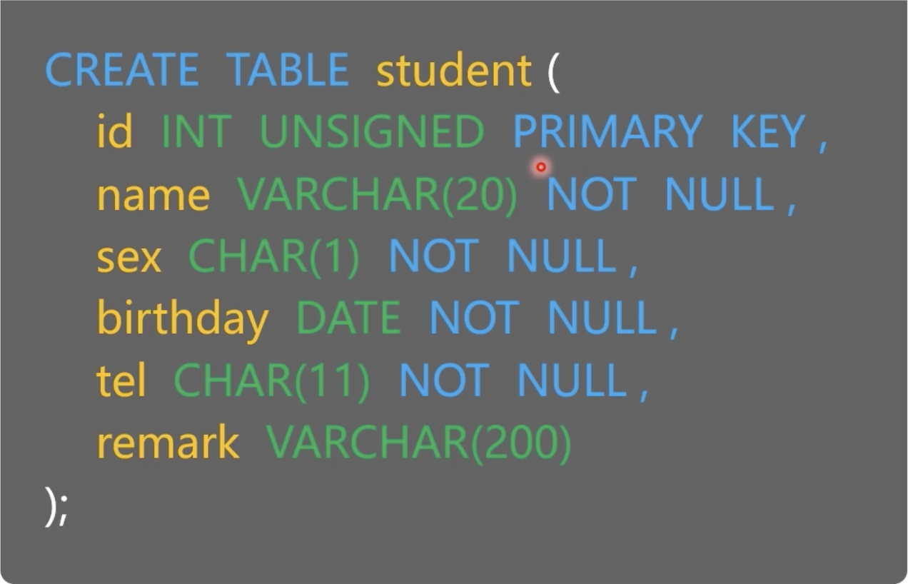
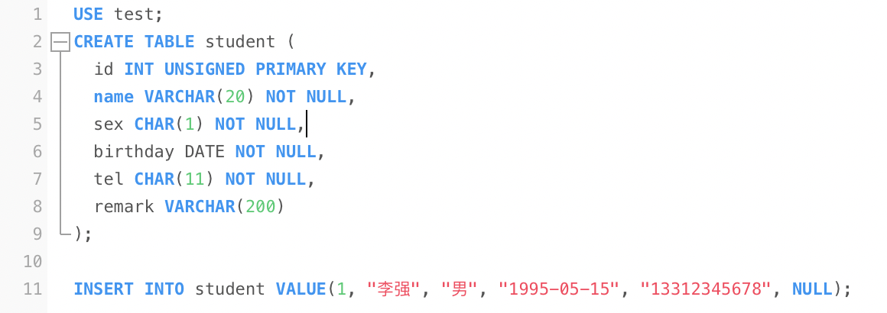
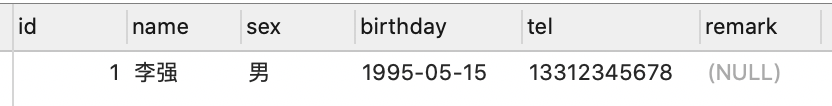
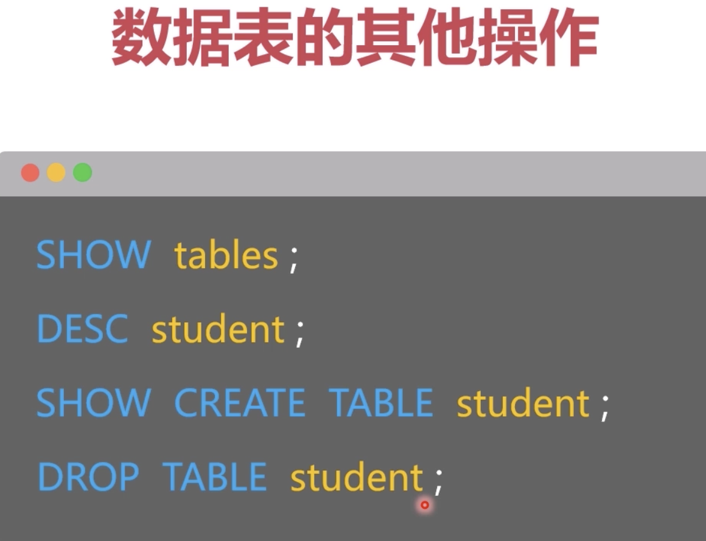

# mysql-learning
### 第一章：MySQL介绍
* 操作系统中数据存放的载体：
  * Windows, Linux和MacOS都是基于文件(eg: AVI, DOC, JPG, TXT)的操作系统
* 什么是数据库系统Database Management System？
  * 数据库系统(DBMS)是指一个能为用户提供信息服务的系统。它实现了有组织地，动态地存储大量相关数据的功能，提供了数据处理和信息资源共享的便利手段。
* 什么是关系型数据库系统Relational Database Management System？
  * 关系型数据库系统(RDBMS)是指使用了关系模型的数据库系统
  * 关系模型中，数据是分类存放的，数据之间可以有联系
  * 关系型数据库是多线程的，例如秒杀系统，有100库存，使用关系型数据库很容易超卖，就因为是你多线程的，不好控制
* 什么是NoSQL数据库系统？
  * NoSQL数据库指的是数据分类存放，但是数据之间没有关联关系的数据库系统
  * Redis是一种常见的NoSQL数据库， 是单线程的
  * 常见的主流NoSQL数据库：Redis（使用内存保存数据的），MemCache（使用内存保存数据的）， MOngoDB（使用硬盘保存数据的，保存海量低价值的数据是很有价值的， eg：新闻， 消息， 朋友圈，回帖等）， Neo4J（使用硬盘保存数据的，适用于保存复杂的组织关系和人际关系）
  * NoSQL数据库的应用场景 eg： 秒杀库存， 登录信息， 消息通知， 新闻
* MySQL数据库
  * MySQL是应用最广泛，普及度最高的开源关系型数据库
  * mysql -uroot -p
  * show databases;
  * CREATE DATABASE name;
  * 增删改查 -> Insert, Delete, Update, Select
  * net stop mysql80
  * net start mysql80
  * MySQL默认端口号3306, 80端口是HTTP常用端口
* 重设root密码
  * 创建一个TXT文件，定义修改密码的SQL语句
  * ALTER USER 'root'@'localhost' IDENTIFIED BY '123456';
* MySQL配置文件
  * 注意区分mac版mysql与Windows版的mysql配置文件扩展名不同:
  * mac下: my.cnf
  * windows下: my.ini
  * 在my.ini文件中，我们可以设置各种MySQL的配置，例如字符集，端口号，目录地址等等
* 本章总结：
  * 掌握了windows平台上MySQL数据库的安装与管理，明白逻辑库，数据表与数据目录的对应关系
  * 懂得MySQL数据库的常用参数设置：端口号，字符集， IP绑定，连接数等等
  * 掌握MySQL数据库的用户管理，能创建用户并分配权限，设置远程登陆（%）
  * 对于MySQL数据库上的忘记密码的账户，能重置该账户的密码信息
### 第2章：数据库表的相关操作
* 学习目标
  * 管理逻辑库和数据表 -> 创建，删除，修改逻辑库和数据表
  * 了解常用的数据类型和约束 -> 字符串，整数，浮点数，精确数字，日期，枚举。主键约束，非空约束，唯一约束，外键约束等
  * 掌握索引运行机制和使用原则 -> 排序为什么可以提高数据检索速度？ 怎么创建和删除索引？ 什么条件下使用索引？
* 什么是SQL语言？
  * SQL是用于访问和处理数据的标准的计算机语言
* SQL语言分类、
  * DML -> Data Manipulation Language:  添加，删除，修改， 查询
  * DCL -> Data Control Language: 用户，权限，事务
  * DDL -> Data Definition Language: 逻辑库， 数据表， 视图， 索引
* SQL语句注意事项
  * SQL语句不区分大小写， 但是字符串区分大小写
  * SELECT "HelloWorld";
  * SQL语句必须以分号结尾
  * SQL语句中的空白和换行没有限制，但是不能破坏语法
* SQL语句的注释
  * SQL语句的注释有两种，分别如下：
  * #这是一段注释文字
  * /* 这是另一段注释文字 */
* 创建逻辑库(属于DDL分类语句)
  * CREATE DATABASE name;   name -> 逻辑库名称
  * SHOW DATABASES;
  * DROP DATABASE name;
* 创建数据表
  * {:height="50%" width="50%"} 
* {:height="50%" width="50%"} 
  * INT UNSIGNED 无符号的整数（即非负数）
  * PRIMARY KEY 主键
  * VARCHAR(20)  字符串，最大不能超过20个字符
  * NOT NULL 非空
  * DATE 日期
  * CHAR(1) 固定长度的字符，长度为1
* {:height="50%" width="50%"} 
  * 一个数据库中有很多逻辑空间，如果想在某个逻辑空间里添加表table，首先要USE test(使用test这个逻辑空间），然后CREATE TABLE 数据表(...)
  * INSERT INTO student VALUE(1, "李强", "男", "1995-05-15", "13312345678", NULL);  -> 插入一条数据
*  
* {:height="50%" width="50%"} 
  * DESC student -> 查看student这个表的结构详情信息
  * SHOW CREATE TABLE student -> 查看student这个表当初创建时候的sql语句
  * DROP TABLE student -> student这个数据表不想要了（注意这条语句的意思不是删除这个表的数据）
  
